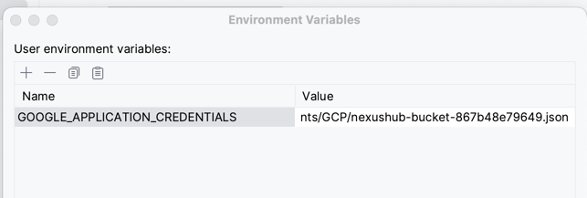
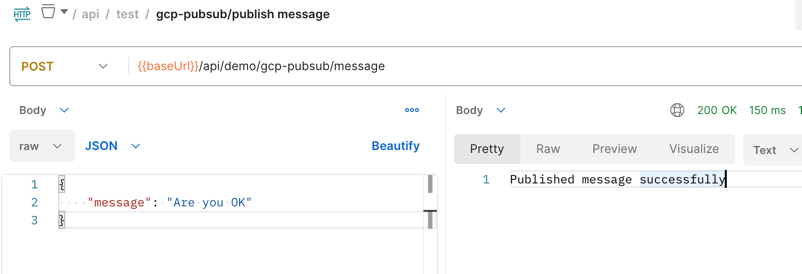
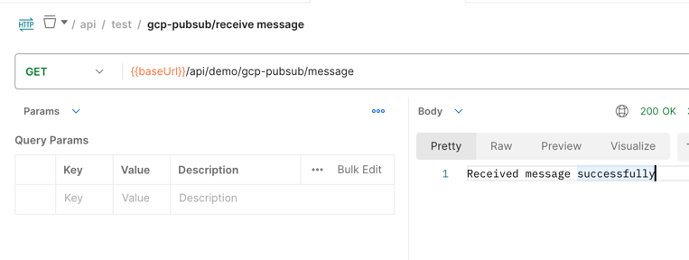

# demo-gcp-pubsub
Demo GCP PubSub and Storage - Authenticate by Google Cloud Service

## How to run
Setup environment variable: GOOGLE_APPLICATION_CREDENTIALS

## Testing
POST - {{baseUrl}}/api/demo/gcp-pubsub/message

GET - {{baseUrl}}/api/demo/gcp-pubsub/message

